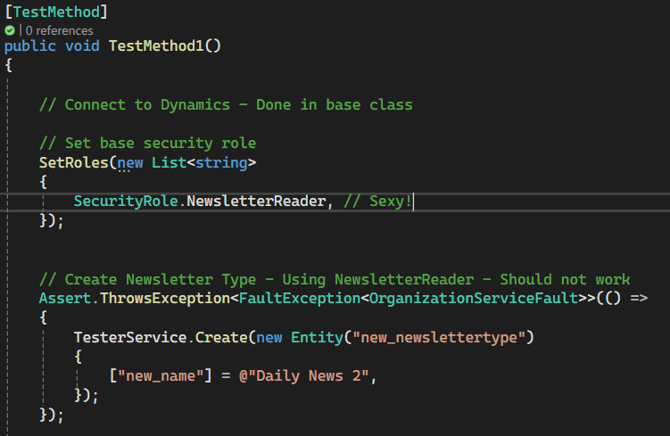

# Dynamics CRM Security Role Testing

A simple VisualStudio project allowing you to test your Dynamics Security roles. Works in the following way:

- Allows you to generate a class with all your system's security role names
- Allows you to connect to Dynamics and write tests for your security roles
- Allows you to easily switch test user's security roles to validate them.




# Setup

1. In dynamics, prepare connection strings for two **Application users** (or Service Users or S2S apps)
   - A **testing user** whose security roles will change
   - An **admin user** able to change security roles of other users (preferably System Administrator)
2. Configure the **LS.SecurityRoleGenerator**
   - Open Visual Studio, right click on the project, select "Manage User Secrets"
   - Use this template:

```json
{
  "AdminConnectionString": "AuthType=ClientSecret;Url=https://url.crmx.dynamics.com;ClientId=your-client-id;ClientSecret=your-client-secret", // The connection string of your admin user
  "ClassNamespace": "LS.SecurityTesting", // Or change the namespace to your liking, but make sure it matches your Test project.
  "OutputFile": "SecurityRoles.cs" // The output file name. Open your testing project, right click on "SecurityRoles.cs", select Copy full Path, paste it here.
}
```

3. Run **LS.SecurityRoleGenerator**
   - Open your **SecurityRoles.cs** and check if you see all your security roles.
4. Configure **LS.SecurityTesting**
   - Open Visual Studio, right click on the project, select "Manage User Secrets"
   - Use this template:

```json
{
  "TesterConnectionString": "AuthType=ClientSecret;Url=https://url.crmX.dynamics.com;ClientId=your-client-id;ClientSecret=your-client-secret", // testing user's connection string
  "AdminConnectionString": "AuthType=ClientSecret;Url=https://url.crmX.dynamics.com;ClientId=your-client-id;ClientSecret=your-client-secret" // Admin user's connection string
}
```


Then you should be able to run your Security tests. Make sure to run **LS.SecurityRoleGenerator** every time you add a new security role.

Enjoy!

